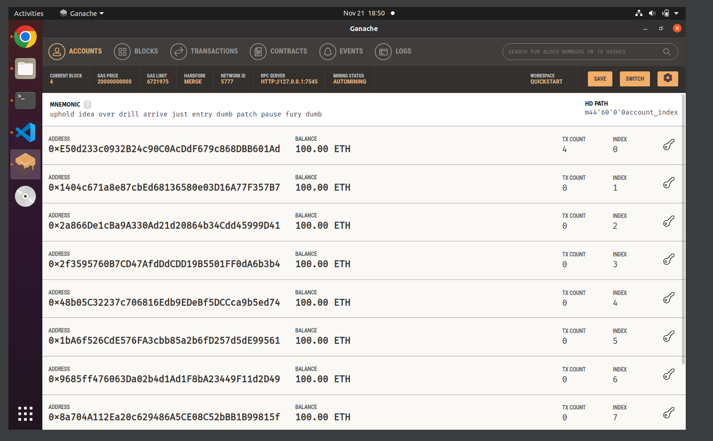
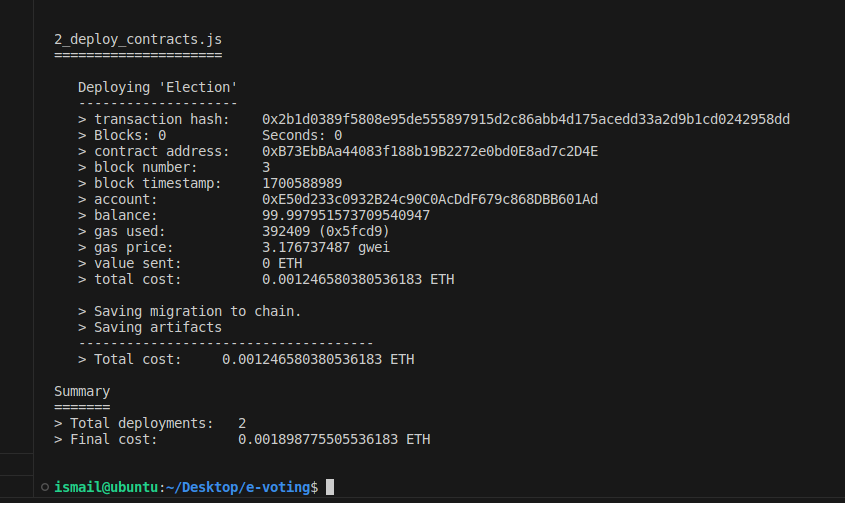
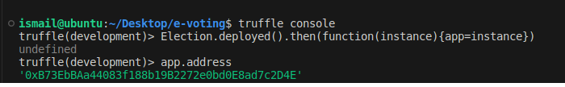
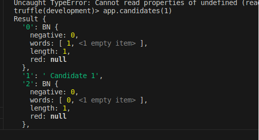
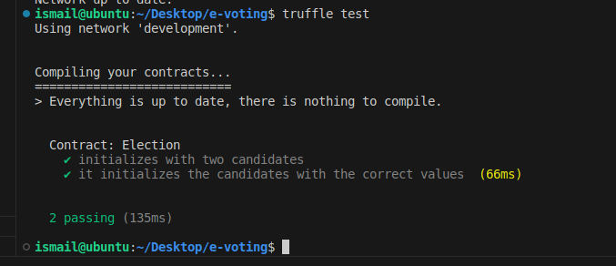
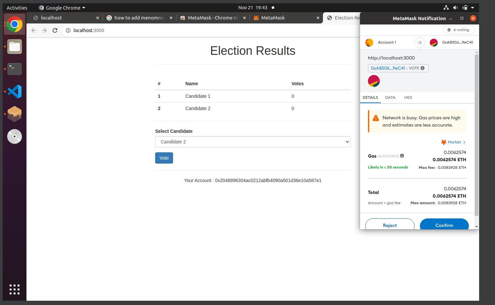
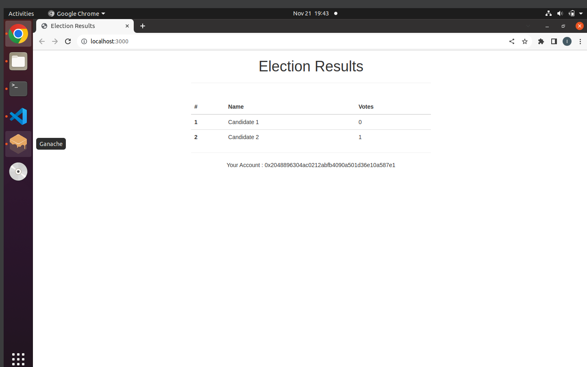

# tp2-blockchain-e-voting

This lab is an electronic voting (e-voting) system implemented as a decentralized application (Dapp) on the Ethereum blockchain.

## Setting up the Development Environment

Before getting started, ensure that you have the following prerequisites installed:

- Node.js (v8+ LTS) and npm
- Git
- [Ganache](https://trufflesuite.com/ganache) - a personal blockchain for Ethereum development
- Truffle - Install it using the following command:

```bash
npm install -g truffle
```

Verify that Truffle is installed by running:

```bash
truffle version
```
## Creating a Truffle Project

Initialize your Truffle project using the pet-shop Truffle Box:

```bash
truffle unbox pet-shop
```
Or clone this repository:

```bash
git clone https://github.com/IsmailCharfi/tp2-blockchain-e-voting.git
```

## Creating the Election Smart Contract

We Creatde the Election smart contract in the `contracts` directory. Using the Solidity language to define the contract's logic, candidates, and voting mechanisms.

## Writing Deployment Code

In the `migrations` directory, we created a JavaScript file to deploy the Election smart contract to the blockchain. 

## Writing Test Code

We created JavaScript tests for Election smart contract. Using Truffle's testing framework to ensure that our smart contract behaves as expected.

## Building the User Interface

We created an HTML and JavaScript user interface to allow voters to interact with the e-voting Dapp. 
## Compiling and Migrating the Smart Contract

### Migration

Ensure that Ganache is running on port 7545, and migrate the contract to the blockchain:

```bash
truffle migrate
```



We can use the truffle console to ineract with our contract

```bash
truffle console
```



## Testing the Smart Contract

Run the JavaScript tests:

```bash
truffle test
```


## Interacting with the Dapp

1. Install [MetaMask](https://metamask.io/) in your browser.

2. Open MetaMask and click on "Add new network." and add the local blockchain network http://127.0.0.1:7545

3. Start the local web server for the Dapp:

```bash
npm run dev
```


4. Connect MetaMask to your local blockchain.

5. Cast your vote in the Dapp.

6. Approve the connection to the Dapp in MetaMask.

7. View the election results on the Dapp.

